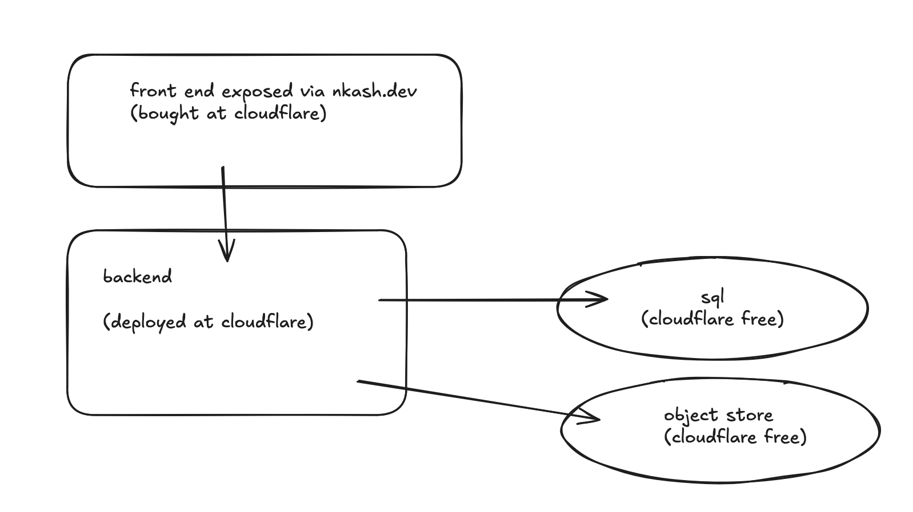

# Architecture

## Initial design



*Drawn 2026-09-13. Kept as the original sketch — later decisions are recorded below rather than
by editing it.*

## One deliberate departure from the sketch

The sketch has **frontend** and **backend** as two boxes. Logically that is exactly right, and
the code keeps that separation strictly. Physically they are **one Cloudflare Worker**.

Splitting them into two deployed Workers would mean every page view costs two invocations
instead of one, against a budget of 100,000 per day, and adds a network round trip inside the
request. There is nothing to gain: the Astro SSR app *is* a backend — it runs server-side, on
demand, with direct bindings to D1 and R2.

So the separation is enforced by a module boundary rather than a network boundary:

```
  request
     │
     ▼
  ┌─────────────────────────────────────────────┐
  │  one Worker                                 │
  │                                             │
  │  pages/ ── render, never touch a binding    │
  │     │                                       │
  │     ▼                                       │
  │  lib/data/ ── the only code that knows      │
  │     │         D1 and R2 exist               │
  └─────┼───────────────────────────────────────┘
        │
        ├──────────────► D1     (SQL: post rows)
        └──────────────► R2     (objects: images, attachments)
```

`lib/data/` is the seam. Pages call `posts.list()` and `posts.get(slug)`; they never see a
`D1Database` or an `R2Bucket`. If the storage ever moves — to Turso, to Postgres, to a separate
service on its own domain — that directory is what gets rewritten, and the page components do
not change. That is the real content of the two-box drawing, and it survives without paying for
a second Worker.

## Why each store

| Store | Holds | Why |
|---|---|---|
| **D1** (SQLite) | Post rows: metadata, rendered HTML, source markdown | Queryable, transactional, native binding. 5 GB, 5M row reads/day free |
| **R2** | Images and attachments | 10 GB free, and no egress charges — which is the part that matters for images |

### Rendered HTML is stored, not rendered per request

The free plan gives each request **10ms of CPU**. Parsing markdown on every page view spends
that budget for no reason, since the output is identical every time. So `publish` renders at
write time and stores the HTML; serving a post is one indexed `SELECT` and a response write.
The original markdown is stored alongside it so posts can be re-rendered in bulk if the
pipeline ever changes.

### Indexing is not optional here

D1 bills "rows read" as *rows the engine examined*, not rows returned — an unindexed filter
over a 5,000-row table costs 5,000 row reads to return one post. Every query path the site
uses has a covering index in `schema.sql` for that reason, not for latency.

## What stays in git

The engine. Not the content, and not identity.

Posts live in D1, so they are never committed — which is what makes this repo safe to make
public while `private` posts stay private. `OWNERS` and `CIRCLE` are environment variables for
the same reason: a GitHub login in a public git history is permanent and searchable even after
a later commit removes it.
